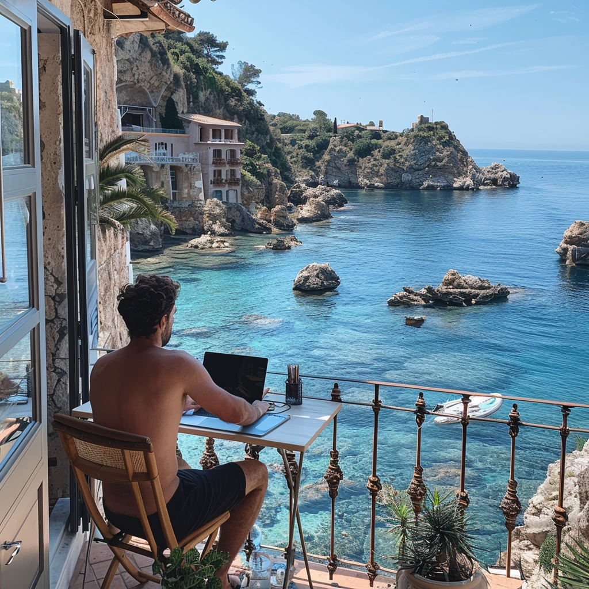

# Desvendando a Realidade: IA ou Autêntico?

## 📒 Descrição
Neste projeto, exploramos o potencial das IAs Generativas para criar imagens que imitam a realidade de forma impressionante. Inspirado pela hype "Natty or Not" do fisiculturismo, nosso desafio foi criar uma imagem que testasse a linha entre o real e o gerado por IA, utilizando o Midjourney para gerar uma cena altamente detalhada e sofisticada.

  

## 🤖 Tecnologias Utilizadas
- **IA Generativa para Imagens**: Midjourney

## 🧐 Processo de Criação
1. **Criação do Conteúdo**: Utilizei o Midjourney para gerar uma imagem com o prompt "programmer working from computer in a villa balcony on the coast of Italy". O objetivo era criar uma cena que fosse visualmente convincente e testasse a capacidade da IA em criar um ambiente realista.
2. **Avaliação da Imagem**: A imagem foi avaliada para verificar se apresentava características que poderiam ser confundidas com uma fotografia real ou se tinha elementos que revelassem sua origem como uma criação de IA.

## 🚀 Resultados
O resultado foi uma imagem gerada que retrata um programador trabalhando em uma varanda de villa na costa da Itália, capturando um ambiente idílico e luxuoso. O foco foi verificar a capacidade da IA em criar uma cena realista e observar se a imagem poderia ser identificada como gerada por IA ou se pareceria autêntica.

## 💭 Reflexão (Opcional)
Criar uma imagem verdadeiramente "natty" com IA é um desafio significativo. A linha entre o conteúdo gerado por IA e o autêntico está cada vez mais tênue. Este exercício destaca as capacidades e limitações da tecnologia na criação de imagens que imitam a realidade, proporcionando uma visão interessante sobre como essas tecnologias influenciam nossa percepção da realidade.

## 📸 Tema da Imagem
A imagem gerada captura um programador trabalhando em um cenário luxuoso e relaxante. A cena, criada pelo Midjourney, foi projetada para misturar trabalho e lazer com uma vista deslumbrante para o mar. O objetivo foi testar se uma imagem tão detalhada e sofisticada poderia ser confundida com uma fotografia real ou se apresentaria sinais de ser uma criação artificial.

## 🤔 E você, o que acha?
Diante desta imagem criada com IA, você consegue identificar se é uma criação artificial ou se poderia ser uma fotografia real? Deixe sua opinião e compartilhe suas impressões sobre a linha entre o real e o gerado por IA!
